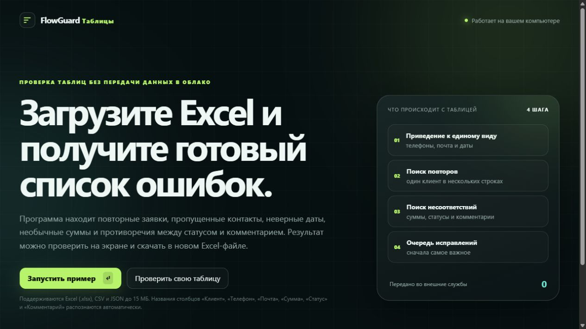
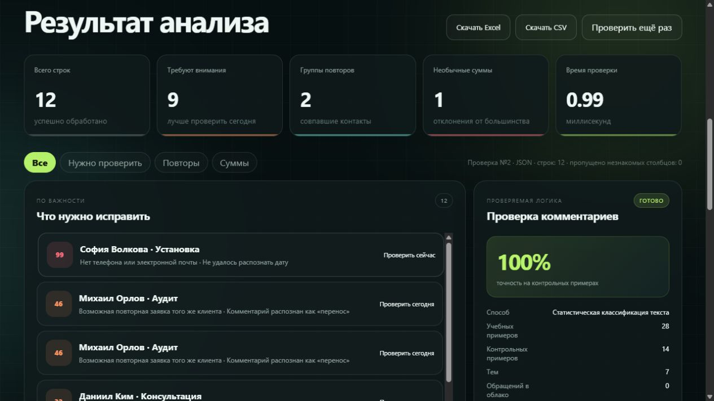

# FlowGuard Таблицы

Локальная программа для быстрой проверки рабочих таблиц. Пользователь загружает
Excel, CSV или JSON, а FlowGuard показывает повторы, пропущенные контакты,
неверные даты, необычные суммы и противоречия между статусом и комментарием.
Результат можно скачать в новом Excel-файле.

**Текущая версия:** 0.1.0. Готовая сборка для Windows запускается одним файлом
и не требует установленного Python. Исходный код открыт для проверки, обучения
и некоммерческого использования; для применения в работе нужна коммерческая
лицензия.

Программа не отправляет содержимое таблицы во внешние службы. Это особенно
полезно небольшим компаниям, администраторам, самозанятым и специалистам,
которые ведут заявки, клиентов, записи или заказы в Excel.





## Что получает пользователь

- понятный список строк, которые требуют проверки;
- поиск повторов по приведённому к единому виду телефону, почте или имени;
- поиск пропущенных контактов и некорректных дат;
- обнаружение сумм, заметно отличающихся от большинства;
- распознавание тем русских и английских комментариев;
- объяснение причины для каждой найденной проблемы;
- выгрузку результата в Excel и CSV;
- локальную историю проверок в небольшой базе SQLite;
- работу без ключей платных нейросетей и без передачи таблицы в облако.

## Быстрый запуск

### Готовая Windows-версия

1. Откройте раздел **Releases** на GitHub. Это раздел с готовыми выпусками
   программы.
2. Скачайте архив `FlowGuardTables-0.1.0-windows.zip`.
3. Распакуйте архив и дважды нажмите `FlowGuardTables.exe`.
4. В открывшейся странице нажмите «Запустить пример».

### Запуск исходного кода

Требуются Windows и Python 3.11 или новее.

```powershell
python -m pip install -r requirements.txt
.\run.ps1
```

После запуска откройте <http://127.0.0.1:8787> и нажмите
«Запустить пример». Подробная инструкция находится в
[`docs/QUICKSTART_RU.md`](docs/QUICKSTART_RU.md), а полное руководство — в
[`docs/USER_MANUAL_RU.md`](docs/USER_MANUAL_RU.md).

## Поддерживаемые столбцы

Программа автоматически узнаёт распространённые русские и английские названия:

| Данные | Примеры названий столбца |
|---|---|
| Клиент | `Клиент`, `ФИО`, `Имя клиента`, `Client name` |
| Телефон | `Телефон`, `Номер телефона`, `Phone` |
| Почта | `Почта`, `Электронная почта`, `Email` |
| Дата | `Дата`, `Дата записи`, `Дата и время` |
| Статус | `Статус`, `Состояние`, `Status` |
| Сумма | `Сумма`, `Стоимость`, `Цена`, `Amount` |
| Комментарий | `Комментарий`, `Примечание`, `Сообщение` |
| Источник | `Источник`, `Канал`, `Source` |
| Ответственный | `Ответственный`, `Менеджер`, `Сотрудник` |

Незнакомые столбцы не удаляются из исходного файла: программа просто сообщает,
что не использовала их в текущей проверке.

## Проверка качества

```powershell
python -m unittest discover -s tests -v
```

Сейчас набор содержит 12 автоматических проверок: нормализация телефонов,
повторы, противоречия, необычные суммы, ограничение размера выборки и импорт
русских CSV, JSON и Excel.

Фактический отчёт о проверке выпуска:
[`docs/TEST_REPORT_0.1.0_RU.md`](docs/TEST_REPORT_0.1.0_RU.md).

## Как устроено решение

- Python выполняет правила, статистическую проверку и выдаёт локальные страницы;
- SQLite хранит историю запусков в одном локальном файле;
- HTML, CSS и JavaScript создают интерфейс без отдельной установки сервера;
- небольшой локальный статистический классификатор определяет смысл комментария;
- важные решения остаются за человеком: программа ничего не удаляет и не
  меняет в исходной таблице автоматически.

Подробности: [`docs/ARCHITECTURE.md`](docs/ARCHITECTURE.md).

## Ограничения

- до 5 000 строк и до 15 МБ за одну проверку;
- читается первый лист Excel-файла;
- совпадения по контактам ищутся после нормализации, но без рискованного
  «угадывания» похожих фамилий;
- классификатор комментариев является прозрачным локальным компонентом, а не
  заменой человеку;
- текущая версия рассчитана на одного пользователя на локальном компьютере.

## Использование и покупка

Исходный код доступен для личного изучения, исследования и некоммерческой
проверки по лицензии PolyForm Noncommercial 1.0.0. Это лицензия с доступным
исходным кодом, но не лицензия свободного программного обеспечения.
Использование в компании,
оказание платных услуг с помощью программы, перепродажа или внедрение для
клиента требуют отдельной коммерческой лицензии.

Варианты покупки и внедрения описаны в [`COMMERCIAL.md`](COMMERCIAL.md).

Связь с автором: Telegram [@shishenko_dev](https://t.me/shishenko_dev).

## Автор

Илья Шишенко — разработка автоматизации, интеграций и прикладных решений на
Python. Проект использует только вымышленные демонстрационные данные.
